<p align="center">


</p>

<span align="center">
  
[](https://www.npmjs.com/package/homebridge-cmd4-advantageair)
[](https://www.npmjs.com/package/homebridge-cmd4-advantageair)
[](https://github.com/homebridge/homebridge/wiki/Verified-Plugins)
  
</span>

# homebridge-cmd4-AdvantageAir

Catered shell script to integrate air conditioner control units by Advantage Air into Homekit using the plug-in [homebridge-cmd4](https://github.com/ztalbot2000/homebridge-cmd4). 

No affiliation with Advantage Air.

## Supported Control Units:
* Air Conditioning:
  * [e-zone](https://apps.apple.com/au/app/e-zone/id925994857)
  * [MyAir](https://apps.apple.com/au/app/myair/id481563583)
  * [MyAir4](https://apps.apple.com/au/app/myair4/id925994861)
  * MyAir5 - Appears to use the same app as MyPlace.
  * [MyPlace](https://apps.apple.com/au/app/myplace/id996398299)
  * [zone10e](https://apps.apple.com/au/app/zone10e/id1076850364)
  * [Fujitsu anywAIR](https://apps.apple.com/au/app/anywair/id1509639853)

<I><B> Note: </B> [zone10](https://apps.apple.com/au/app/zone10/id510581478) and [MyAir3](https://apps.apple.com/au/app/myair3/id645762642) do not appear to work with this plug-in. </I>

* Extras:
  * [MyPlace](https://apps.apple.com/au/app/myplace/id996398299)
     - [x] Lights 
     - [x] Garage Door
     - [x] Gate
     - [ ] Motion Sensors
     - [ ] Blinds

<I><B> Note: </B> Config for these extras can be found [here](https://github.com/mitch7391/homebridge-cmd4-AdvantageAir/wiki/Config-Creation#myplace-extras). </I>


## How It Looks:
### Air Conditioning - Thermostat Mode (with Fan Speed) and Fan or FanSwitch Mode:
<p align="left">
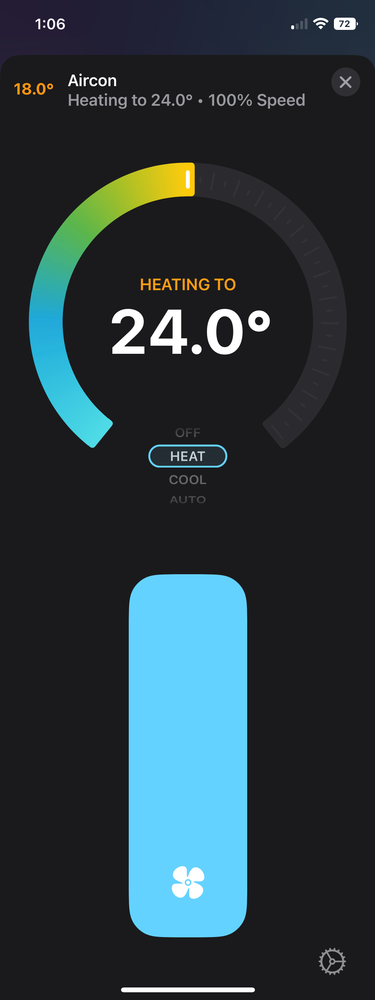
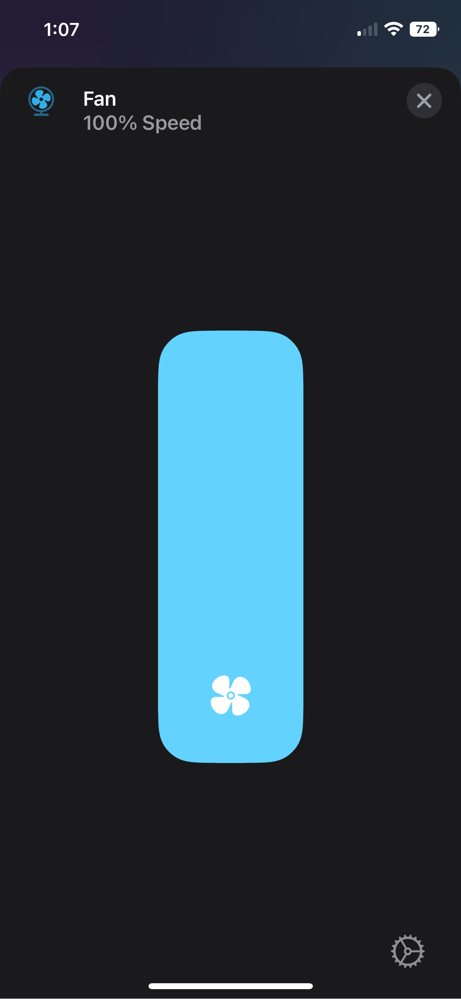
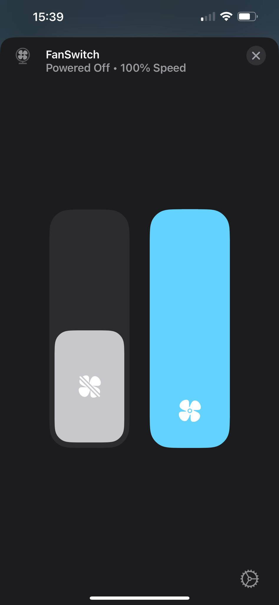
</p>

### Air Conditioning - Zone Control and Temperature Sensors:
<p align="left">
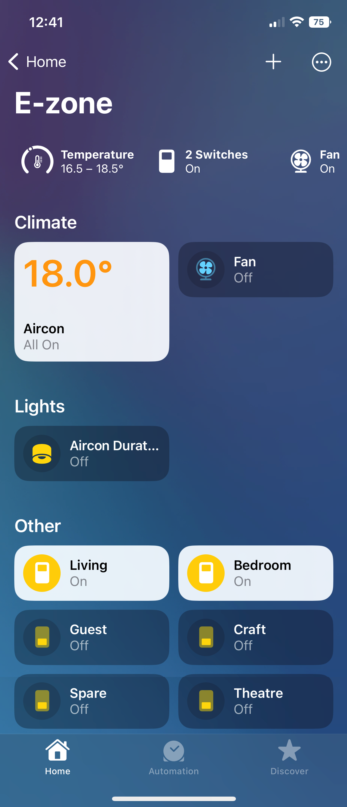
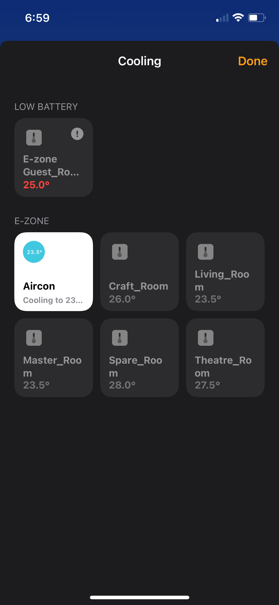
</p>

### Air Conditioning - Zone Control without Temperature Sensors: 
<p align="left">
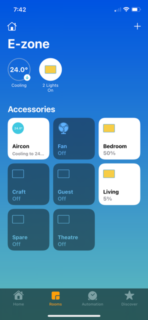
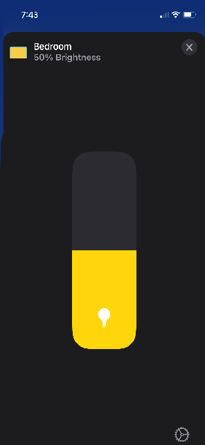
</p>

### MyPlace Extras - Lights: 
<p align="left">
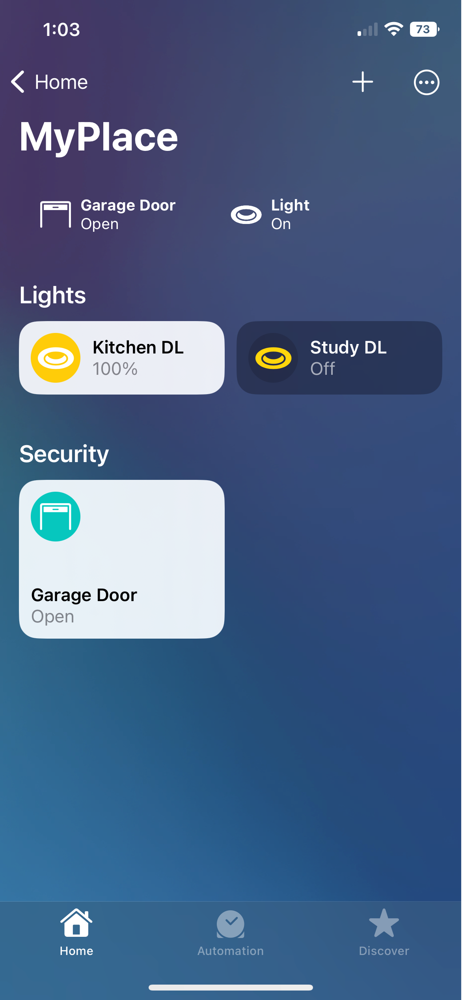
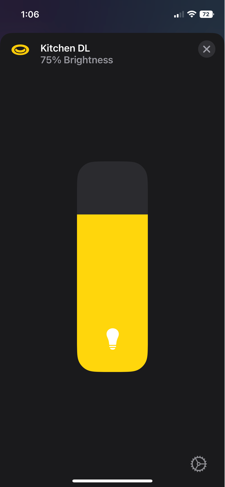
</p>

### MyPlace Extras - Garage Door / Gate: 
<p align="left">
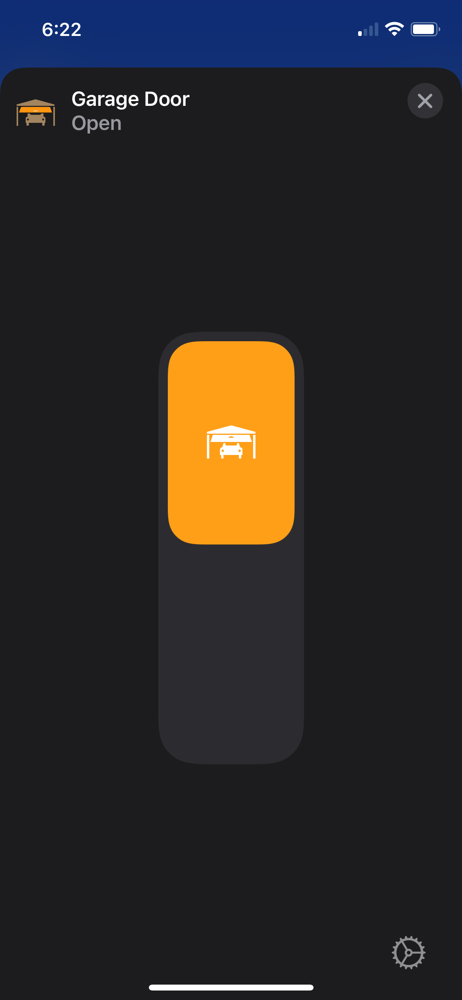
</p>
<I><B> Note: </B> Garage Door / Gate will appear in Apple CarPlay. </I>

## Installation:
### Raspbian/HOOBS/macOS/NAS:
1. Install Homebridge via these instructions for [Raspbian](https://github.com/homebridge/homebridge/wiki/Install-Homebridge-on-Raspbian), [HOOBS](https://support.hoobs.org/docs) or [macOS](https://github.com/homebridge/homebridge/wiki/Install-Homebridge-on-macOS).
2. Install the [homebridge-cmd4](https://github.com/ztalbot2000/homebridge-cmd4) plug-in via the Homebridge UI ['plugins'](https://github.com/oznu/homebridge-config-ui-x#plugin-screen) tab search function. Once installed, a pop-up box with a small config in it will appear. Do not edit anything and make sure you click `SAVE`.

     <p align="left">
     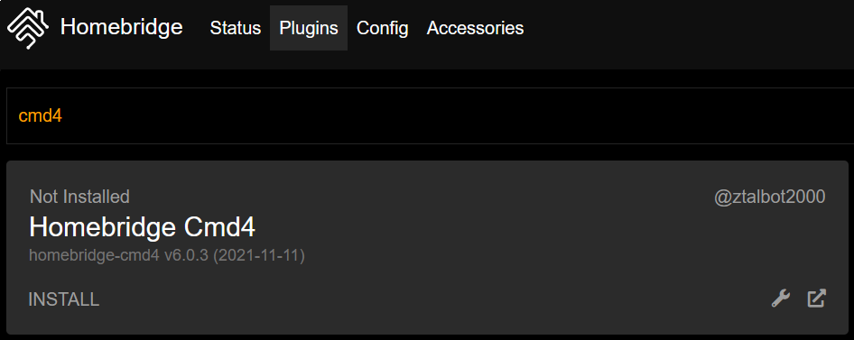
     </p>

3. Install `homebridge-cmd4-AdvantageAir` plug-in via the Homebridge UI 'plugins' tab search function.

     <p align="left">
     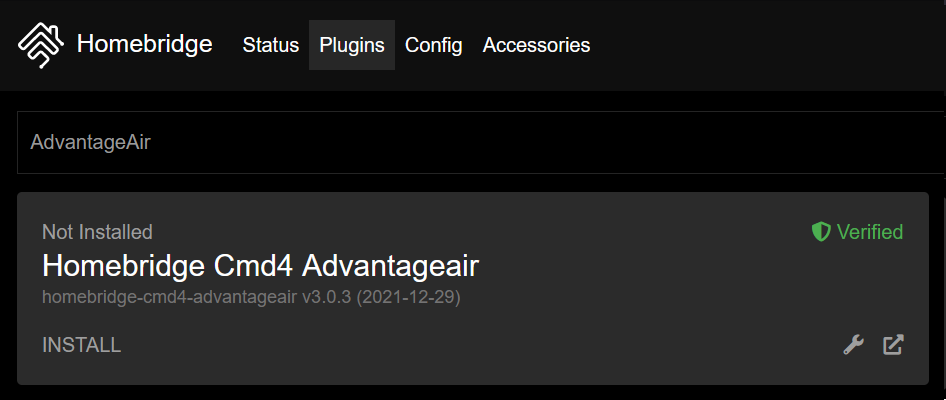
     </p>

4. Install <B>jq</B> via your Homebridge UI terminal or through ssh: 
```shell
# Raspbian/Hoobs:
sudo apt-get install jq

# macOS:
brew install jq

# Synology NAS:
apt-get install jq

# QNAP NAS:
apk add jq
```
5. Check if <B>curl</B> is installed (it should already be):
```
curl -V
```
6. If <B>curl</B> does not return a version number, install via:
```shell
# Raspbian/Hoobs:
sudo apt-get install curl

# macOS:
brew install curl

# Synology NAS:
apt-get install curl

# QNAP NAS:
apk add curl
``` 
7. Automatically create your Homebridge `config.json`:
* Homebridge users with access to the Homebridge web UI can jump ahead to `Step 8`.
* Homebridge users without access to the Homebridge web UI can use the following [terminal instructions](https://github.com/mitch7391/homebridge-cmd4-AdvantageAir/wiki/Config-Creation#homebridge-terminal-instructions).
* HOOBS users do not have access to our Homebridge UI (for now!) and will have to use the following [terminal instructions](https://github.com/mitch7391/homebridge-cmd4-AdvantageAir/wiki/Config-Creation#hoobs-terminal-instructions).

8. Go to the 'plugins' tab in Homebridge UI and locate your newly installed `homebridge-cmd4-AdvantageAir`. Click `SETTINGS` and it should launch the 'Advantage Air Configuration Creator'.
     <p align="left">
     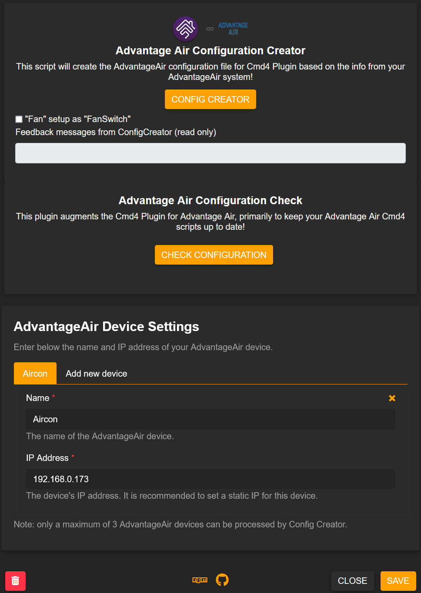
     </p>

9. Scroll down to the 'AdvantageAir Device Settings' area and fill out the `Name`, `IP Address` and `PORT used` fields (default PORT is `2025` for most users, Fujitsu anywAIR users set this to `10211` ). If you have more than one Advantage Air tablet, you can click `Add new device` to setup the others. Click `SAVE` when done editing, it will close the UI and you will need to open it once more as per Step 8 before proceding further.
10. Check/uncheck the the following checkboxes/radio-buttons to select your preferred setup options, then press the `CONFIG CREATOR` button to create your Advantage Air config.
    - [x] Use a "Switch" accessory as "On/Off" control for "Fan" state:
    
    "FanSwitch" setup allows the current fanSpeed to be displayed on Homekit tile when the Aircon is On and is in Cool, Heat or Dry (Auto) mode.
    
    <p align="left">
    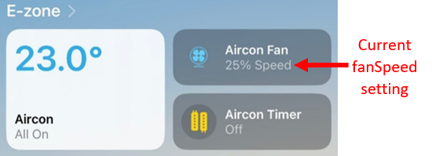
    </p>

    - [x] Include fancy timers to turn-on the Aircon in specific mode: Cool, Heat or Vent:
  
    This will generate extra timers to turn-on the Aircon in specidic mode: Heat, Cool or Vent.

     ### Zone Control setup options:
    * Use "Lightbulb/Switch" * accessory with standalone temperature and myZone switch (legacy):
    
         For systems with Temperature Sensors, this option will use the `Switch` accessory for Zone Control and a separate `TemperatureSensor` for the temperature info.  If myZone is defined, a standalone myZone switch will also be configured.
    
         For systems without Temperature Sensors, this option will use the `Lightbulb` accessory for Zone Control.
    
    *  Use "Lightbulb/Switch" * accessory with integrated temperature but standalone myZone switch:
    
         For systems with Temperature Sensors, this option will use the `Switch` accessory for Zone Control and integrate a linked `TemperatureSensor` for the temperature info. The advantage of this option is to be able to see the zone temperature displayed on the zone itself. If myZone is defined, a standalone myZone switch will also be configured.
    
         For systems without Temperature Sensors, this option will use the `Lightbulb` accessory for Zone Control.

    * Use "Lightbulb" accessory with integrated temperature but standalone myZone switch:
    
         For systems with Temperature Sensors, this option will use the `Lightbulb` accessory for Zone Control and integrate a linked `TemperatureSensor` for the temperature info. The advantage of this option is to have the temperature info and the "zone % open" displayed on the zone itself. _Please note that the `Brightness` which is a proxy for "zone % open" is not user controllable as per AdvantageAir design._ If myZone is defined, a standalone myZone switch will also be configured.
    
         For systems without Temperature Sensors, this option will use the `Lightbulb` accessory for Zone Control and the `Brightness` which is a proxy for "zone % open" is user controllable.

    * Use "Fan" accessory with integrated temperature and myZone switch (recommended):
    
        For systems with Temperature Sensors, this option will use the `Fanv2` accessory for Zone Control with `Fanv2`'s `SwingMode` charateristic being repurposed as the myZone switch and integrate a linked `TemperatureSensor` for the temperature info. The advantage of this option is to have the temperature info & the "zone % open" displayed on the zone itself and able to set this zone as myZone if it hasn't been set yet. _Please note that the `Speed` which is a proxy for "zone % open" is not user controllable as per AdvantageAir design. Please also note that once myZone is set, you cannot unset it. You have to set another zone as myZone to unset it._
    
    <p align="left">
    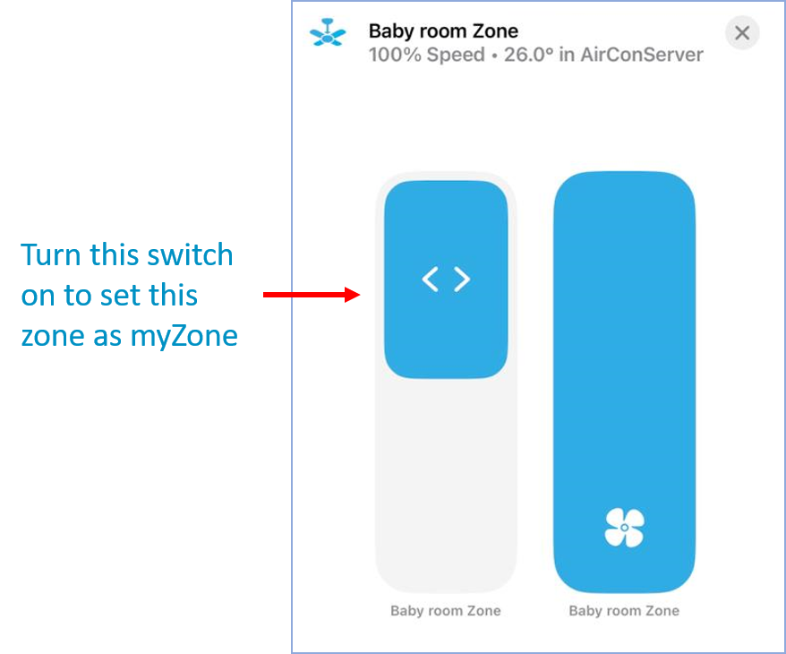
    </p>

    For systems with no Temperature Sensors, this option will use the `Fan` accessory for Zone Control and the `Speed` which is a proxy for "zone % open" is user controllable.


    
11. Click `CHECK CONFIGURATION`. It will check over your installation and config to make sure you have everything correct. On a success it will say `Passed`; if something is incorrect, an error message will pop up telling you what it is that you have missed and need to fix.

     <p align="left">
     
     </p>

     <p align="left">
     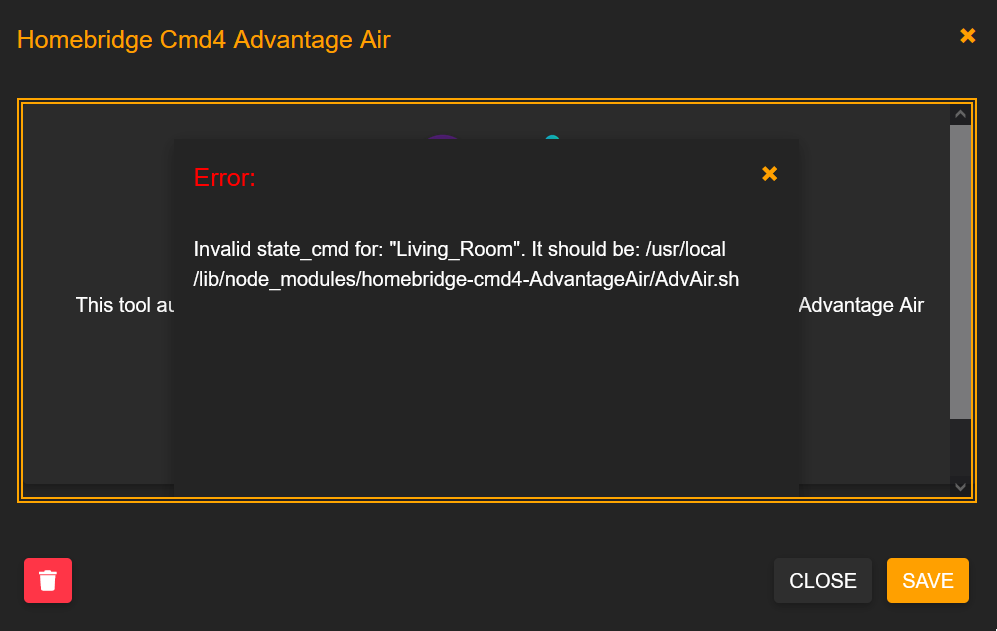
     </p>

12. If you have Cmd4 v7.0.0-beta2 or v7.0.1 or v7.0.2 installed, an optimised version of `Cmd4PriorityPollingQueue.js` module would have been copied to Cmd4 plugin. This optimised version of `Cmd4PriorityPollingQueue.js` module will give you some improvements in performance.

     If for some reasons it was not copied, a script `copyEnhancedCmd4PriorityPollingQueueJs.sh` will be created in `<config.json storage path>` directory and you can run it manually to get it copied.

    The `<config.json storage path>` directory is the directory where "config.json" is stored.  For Raspbian installation, it is typically `/var/lib/homebridge`.  For Mac users, it is typically `$HOME/.homebridge`. For HOOBS users, it is typically `/var/lib/hoobs/<bridge>`.

    Restart homebridge for the change to take effect.

    If you do not find the script `copyEnhancedCmd4PriorityPollingQueueJs.sh` in `<config.json storage path>` directory, it means that the optimised version of `Cmd4PriorityPollingQueue.js` module has been copied to Cmd4 plugin successfully.
    
### Windows OS
I have not successfully set this up on a Windows OS Homebridge server yet. If you have and want to contribute; please reach out and let me know how you did it. Otherwise I strongly suggest you buy a dedicated Raspberry Pi for Homebridge.


## Further Notes
You can read more about this project and how to create your config on the [Wiki](https://github.com/mitch7391/homebridge-cmd4-AdvantageAir/wiki) page.


## How You Can Help:
* Open Issues/Tickets.
* Report Bugs/Errors.
* Suggest Improvements and Features you would like to see!
* Help test the beta releases! See the [Wiki](https://github.com/mitch7391/homebridge-cmd4-AdvantageAir/wiki#beta-testing) to find out how to 'sign up'.  
* Create a fork, add or fix something yourself and create a Pull Request to be merged back into this project and released!
* Let me know if you have a Control Unit or App that works that is not confirmed in my [Supported List](https://github.com/mitch7391/cmd4-AdvantageAir#supported-control-units)!
* Let me know if you can figure out how to get this running on Windows 10/11 Homebridge.
* Feel free to let me know you are loving the project by give me a `Star`! It is nice to have an idea how many people use this project! 


## Special Thanks:
1. The evolution, improvements and continuously tireless work of [John Talbot](https://github.com/ztalbot2000), who has not only improved these shell scripts beyond measure and created the Homebridge UI integration; but continues to improve [homebridge-cmd4](https://github.com/ztalbot2000/homebridge-cmd4) to further cater to this work and my end users.
2. The hard work and valued coding experince of [Ung Sing Wong](https://github.com/uswong) that has led to the many amazing features in a short space of time; and no doubt more to come in the future!
3. This would never have kicked off without the patience and kindness of [TimofeyK](https://github.com/TimofeyK) helping out a new starter find his feet.
4. Lastly, but certainly not least, is my beautiful Wife who has put up with what has become an obsession of mine to get our air conditioner and many other devices into Homekit. May she forever be misunderstood by Siri for my amusement...


## LICENSE:
This plugin is distributed under the MIT license. See [LICENSE](https://github.com/mitch7391/cmd4-E-Zone-MyAir/blob/master/LICENSE) for details.
