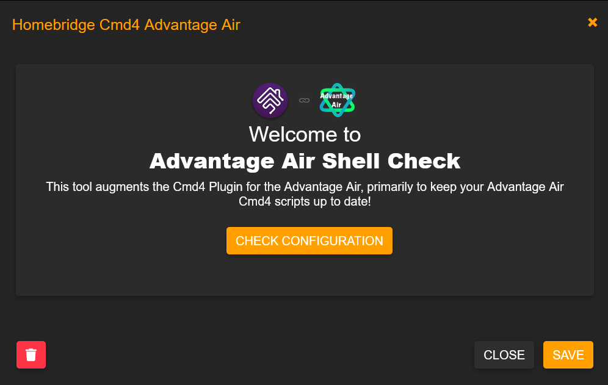

<p align="center">

</p>

# homebridge-cmd4-AdvantageAir

Catered shell script to integrate air conditioner control units by Advantage Air into Homekit using the plug-in [homebridge-cmd4](https://github.com/ztalbot2000/homebridge-cmd4). 

No affiliation with Advantage Air or any of their products.

## Supported Control Units:
* Confrimed:
  * [e-zone](https://apps.apple.com/au/app/e-zone/id925994857)
  * [MyAir](https://apps.apple.com/au/app/myair/id481563583)
  * [MyAir3](https://apps.apple.com/au/app/myair3/id645762642)
  * [MyAir4](https://apps.apple.com/au/app/myair4/id925994861)
  * [MyPlace](https://apps.apple.com/au/app/myplace/id996398299)
  * [zone10e](https://apps.apple.com/au/app/zone10e/id1076850364)
* Unconfirmed:
  * [zone10](https://apps.apple.com/au/app/zone10/id510581478) (potentially confirmed to not be supported)

## How It Looks:
<p align="center">


</p>

## Installation:
### Raspbian/HOOBS/macOS:
1. Install Homebridge via these instructions for [Raspbian/HOOBS](https://github.com/homebridge/homebridge/wiki/Install-Homebridge-on-Raspbian) or [macOS](https://github.com/homebridge/homebridge/wiki/Install-Homebridge-on-macOS).
2. Install the [homebridge-cmd4](https://github.com/ztalbot2000/homebridge-cmd4) plug-in via the Homebridge UI ['plugins'](https://github.com/oznu/homebridge-config-ui-x#plugin-screen) tab search function.


3. Install `homebridge-cmd4-AdvantageAir` plug-in via the Homebridge UI 'plugins' tab search function.


4. Install <B>jq</B> via your Homebridge UI terminal or through ssh: 
```shell
# Raspbian/Hoobs:
sudo apt-get install jq

# macOS:
brew install jq
```
5. Check if <B>curl</B> is installed (it should already be):
```
curl -V
```
6. If <B>curl</B> does not return a version number, install via:
```shell
# Raspbian/Hoobs:
sudo apt-get install curl

# macOS:
brew install curl
``` 
7. Edit your homebridge `config.json` using the samples included in the directory `Config_Samples` above; this should be edited from the Homebridge UI ['config'](https://github.com/oznu/homebridge-config-ui-x#configuration-screen) tab. <I><B>NOTE:</I></B> Two accessories cannot have the exact same `displayName` in your config. E.g. A switch and temperature sensor cannot both be named 'Kitchen'.
8. Restart Homebridge. 
9. Go to the 'plugins' tab in Homebridge UI and locate your newly installed `homebridge-cmd4-AdvantageAir`. Click `SETTINGS` and it should launch the 'Advantage Air Shell Check'.



10. Click `CHECK CONFIGURATION`. It will check over your installation and config to make sure you have everything correct. On a success it will say `Passed`; if something is incorrect, an error message will pop up telling you what it is that you have missed and need to fix.

<p align="center">
  
</p>


### Windows OS
I have not successfully set this up on a Windows OS Homebridge server yet. If you have and want to contribute; please reach out and let me know how you did it. Otherwise I strongly suggest you buy a dedicated Raspberry Pi for Homebridge.


## About:
Due to the current limitations in Homekit, multi-zoned ducted air conditioners are not represented as a single accessory. Our work around here is two create multiple accessories:
* A Thermostat with modes <B>OFF/HEAT/COOL</B> using the Advantage Air 'constant' zone (usually zone 1 in a one 'constant zone' setup) as the measured temperature for feedback. <B><I>NOTE:</B></I> <B>AUTO</B> mode in Homekit is not used in Advantage Air controllers, so it will set the controller to <B>OFF</B>. Setting <B>DRY</B> mode from the controller will then represent in Homekit as <B>OFF</B>. 
* A simple Fan with modes <B>OFF/ON</B> (low, medium, high coming in a future update!) for the controller's <B>FAN</B> mode. <B><I>NOTE:</B></I> Turning the Fan accessory on in Homekit will turn off the Thermostat accessory, and turning the Thermostat accessory on in homekit will turn off the Fan Accessory. When the Fan is turned on in Homekit, it will also execute the <B>AUTO</B> mode in the respective Advantage Air app; just to keep it simple for now.
* Temperature Sensors with feedback from each zone. These also include the <B>FAULT</B> status in the accessory, this is determined by the error codes produced by the controller. <B><I>NOTE:</B></I> According to the Advantage Air developers there is only one fault code; which is used for low battery, dead battery and loss of connection to sensor. I could not get any further information about this and have only seen one fault myself.
* Switches with feedback to open and close each zone for users with Temperature Sensors. These users only need to opne and close the zones. <B><I>NOTE: I do not recommend adding your 'constant zones' (usually zone 1, but there can be a second; represented as a 'C' in the app) as a Switch in Homekit as this zone is not meant to be turned off. I am not responsible for any damage to your ducting if you do manage to shut this zone (not sure it is possible, but just in case) and run the air conditioner.</B></I>
* Light Bulbs are to be used in place of Switches for users without Temperature Sensors. These users will need to control the percentage open of their zones unlike the users with Temperature Sensors.


## How to Keep Up-To-Date:
In our version 3.0.0, this repo is able to be added like a regular plug-in through Homebridge UI even though it is not a typical 'full' plug-in! By adding it through Homebridge UI, you no longer have to manually update the scripts yourself and they will be rolled out to you in updates via Homebridge UI. It is also good to click the `Watch` button in the top right corner of this repo and select `All Activity` or `Custom` and then `Releases`. This will ensure you get an email everytime I push a new release with new features or improvements! Feel free to give me a `Star` as well if you are happy with the work.


## How You Can Help:
* Open Issues/Tickets.
* Report Bugs/Errors.
* Suggest Improvements and Features you would like to see!
* Create a fork, add or fix something yourself and create a Pull Request to be merged back into this repo!
* Let me know if you have a Control Unit or App that works that is not confirmed in my [Supported List](https://github.com/mitch7391/cmd4-AdvantageAir#supported-control-units)!
* Let me know if you can figure out how to get this running on Windows 10/11 Homebridge.
* Feel free to let me know you are loving the set up!


## Further Notes:
* I have only tested this on my own E-zone Advantage Air controller, but the API is exactly the same for MyAir and the named devices at the begining of this README; that is actually where I was able to get the commands and learn how to structure them properly. The API can be found [here](http://advantageair.proboards.com/) once you have registered.
* I am not very savvy with all of this coding work and had a lot of help and direction as I 'learn as I go'; this was a learning curve for me but I plan to keep working on this and improving it.


## Potential Device Limitations:
What we have discovered from over 8 months of trying to improve performance and reduce homebridge/cmd4 log warnings: 

<I>"The air conditioner controller returns successfully incomplete system data when it is in use by the operator and also incomplete system data if any 'Set' operation is in progress. The scripts that send/receive data from the air conditioner controller must not only retry on failures, but also check the validity of the data as the incomplete system data returned presents a successful return code. Even with these features built into the scripts, Cmd4 has implemented a queuing system such that any polling or queries from HomeKit would only send a setValue when no other operation was in progress. This feature in Cmd4 is the WoRM (Write once Read many) queue. While Cmd4 can then manage all traffic to the air conditioner controller, it cannot know if someone is actually interacting with the control tablet. When interacting with the control tablet and Cmd4 is trying to send/receive data simultaneously, errors are unavoidable.  Cmd4 hides these unavoidable errors in debug mode as it retries the transaction and in this way presents a clean console that otherwise would cause panic to the operator."</I> - John Talbot.

## Special Thanks:
1. The evolution, improvements and continuously tireless work of [John Talbot](https://github.com/ztalbot2000), who has not only improved these shell scripts beyond measure and created the Homebridge UI integration; but continues to improve [homebridge-cmd4](https://github.com/ztalbot2000/homebridge-cmd4) to further cater to this work and my end users. 
2. This would never have kicked off without the patience and kindness of [TimofeyK](https://github.com/TimofeyK) helping out a new starter find his feet.
4. Lastly, but certainly not least, is my beautiful Wife who has put up with what has become an obsession of mine to get our air conditioner and many other devices into Homekit. May she forever be misunderstood by Siri for my amusement...

## LICENSE:
See [LICENSE](https://github.com/mitch7391/cmd4-E-Zone-MyAir/blob/master/LICENSE)
